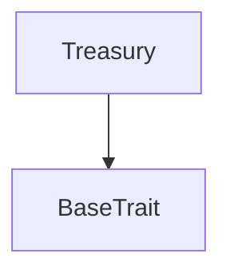

# Tact compilation report
Contract: Treasury
BoC Size: 515 bytes

## Structures (Structs and Messages)
Total structures: 24

### DataSize
TL-B: `_ cells:int257 bits:int257 refs:int257 = DataSize`
Signature: `DataSize{cells:int257,bits:int257,refs:int257}`

### SignedBundle
TL-B: `_ signature:fixed_bytes64 signedData:remainder<slice> = SignedBundle`
Signature: `SignedBundle{signature:fixed_bytes64,signedData:remainder<slice>}`

### StateInit
TL-B: `_ code:^cell data:^cell = StateInit`
Signature: `StateInit{code:^cell,data:^cell}`

### Context
TL-B: `_ bounceable:bool sender:address value:int257 raw:^slice = Context`
Signature: `Context{bounceable:bool,sender:address,value:int257,raw:^slice}`

### SendParameters
TL-B: `_ mode:int257 body:Maybe ^cell code:Maybe ^cell data:Maybe ^cell value:int257 to:address bounce:bool = SendParameters`
Signature: `SendParameters{mode:int257,body:Maybe ^cell,code:Maybe ^cell,data:Maybe ^cell,value:int257,to:address,bounce:bool}`

### MessageParameters
TL-B: `_ mode:int257 body:Maybe ^cell value:int257 to:address bounce:bool = MessageParameters`
Signature: `MessageParameters{mode:int257,body:Maybe ^cell,value:int257,to:address,bounce:bool}`

### DeployParameters
TL-B: `_ mode:int257 body:Maybe ^cell value:int257 bounce:bool init:StateInit{code:^cell,data:^cell} = DeployParameters`
Signature: `DeployParameters{mode:int257,body:Maybe ^cell,value:int257,bounce:bool,init:StateInit{code:^cell,data:^cell}}`

### StdAddress
TL-B: `_ workchain:int8 address:uint256 = StdAddress`
Signature: `StdAddress{workchain:int8,address:uint256}`

### VarAddress
TL-B: `_ workchain:int32 address:^slice = VarAddress`
Signature: `VarAddress{workchain:int32,address:^slice}`

### BasechainAddress
TL-B: `_ hash:Maybe int257 = BasechainAddress`
Signature: `BasechainAddress{hash:Maybe int257}`

### Deploy
TL-B: `deploy#946a98b6 queryId:uint64 = Deploy`
Signature: `Deploy{queryId:uint64}`

### DeployOk
TL-B: `deploy_ok#aff90f57 queryId:uint64 = DeployOk`
Signature: `DeployOk{queryId:uint64}`

### FactoryDeploy
TL-B: `factory_deploy#6d0ff13b queryId:uint64 cashback:address = FactoryDeploy`
Signature: `FactoryDeploy{queryId:uint64,cashback:address}`

### Buy
TL-B: `buy#54c2c2cc queryId:uint64 minTokensOut:coins = Buy`
Signature: `Buy{queryId:uint64,minTokensOut:coins}`

### LaunchToken
TL-B: `launch_token#c90fef8d queryId:uint64 name:^string symbol:^string description:^string imageUrl:^string = LaunchToken`
Signature: `LaunchToken{queryId:uint64,name:^string,symbol:^string,description:^string,imageUrl:^string}`

### TokenLaunched
TL-B: `token_launched#6daa8122 queryId:uint64 jettonMaster:address bondingCurve:address creator:address name:^string symbol:^string = TokenLaunched`
Signature: `TokenLaunched{queryId:uint64,jettonMaster:address,bondingCurve:address,creator:address,name:^string,symbol:^string}`

### FactoryWithdraw
TL-B: `factory_withdraw#a0f63af3 queryId:uint64 amount:coins = FactoryWithdraw`
Signature: `FactoryWithdraw{queryId:uint64,amount:coins}`

### TreasuryFee
TL-B: `treasury_fee#2723fcb4 queryId:uint64 tokenName:^string = TreasuryFee`
Signature: `TreasuryFee{queryId:uint64,tokenName:^string}`

### TreasuryWithdraw
TL-B: `treasury_withdraw#81749110 queryId:uint64 amount:coins destination:address = TreasuryWithdraw`
Signature: `TreasuryWithdraw{queryId:uint64,amount:coins,destination:address}`

### TreasurySetOwner
TL-B: `treasury_set_owner#a3e02f23 newOwner:address = TreasurySetOwner`
Signature: `TreasurySetOwner{newOwner:address}`

### CurveData
TL-B: `_ jettonMaster:address treasury:address realTonReserve:coins realTokenReserve:coins graduated:bool virtualTonReserve:coins virtualTokenReserve:coins = CurveData`
Signature: `CurveData{jettonMaster:address,treasury:address,realTonReserve:coins,realTokenReserve:coins,graduated:bool,virtualTonReserve:coins,virtualTokenReserve:coins}`

### DeployedAddresses
TL-B: `_ jettonMaster:address bondingCurve:address = DeployedAddresses`
Signature: `DeployedAddresses{jettonMaster:address,bondingCurve:address}`

### TreasuryData
TL-B: `_ owner:address balance:coins totalCollected:coins feeCount:uint32 = TreasuryData`
Signature: `TreasuryData{owner:address,balance:coins,totalCollected:coins,feeCount:uint32}`

### Treasury$Data
TL-B: `_ owner:address totalCollected:coins feeCount:uint32 = Treasury`
Signature: `Treasury{owner:address,totalCollected:coins,feeCount:uint32}`

## Get methods
Total get methods: 3

## get_treasury_data
No arguments

## get_balance
No arguments

## get_owner
No arguments

## Exit codes
* 2: Stack underflow
* 3: Stack overflow
* 4: Integer overflow
* 5: Integer out of expected range
* 6: Invalid opcode
* 7: Type check error
* 8: Cell overflow
* 9: Cell underflow
* 10: Dictionary error
* 11: 'Unknown' error
* 12: Fatal error
* 13: Out of gas error
* 14: Virtualization error
* 32: Action list is invalid
* 33: Action list is too long
* 34: Action is invalid or not supported
* 35: Invalid source address in outbound message
* 36: Invalid destination address in outbound message
* 37: Not enough Toncoin
* 38: Not enough extra currencies
* 39: Outbound message does not fit into a cell after rewriting
* 40: Cannot process a message
* 41: Library reference is null
* 42: Library change action error
* 43: Exceeded maximum number of cells in the library or the maximum depth of the Merkle tree
* 50: Account state size exceeded limits
* 128: Null reference exception
* 129: Invalid serialization prefix
* 130: Invalid incoming message
* 131: Constraints error
* 132: Access denied
* 133: Contract stopped
* 134: Invalid argument
* 135: Code of a contract was not found
* 136: Invalid standard address
* 138: Not a basechain address
* 3529: Treasury: zero withdrawal
* 22909: Treasury: insufficient balance
* 32262: Treasury: owner only
* 52547: Treasury: zero fee

## Trait inheritance diagram

## Contract dependency diagram

